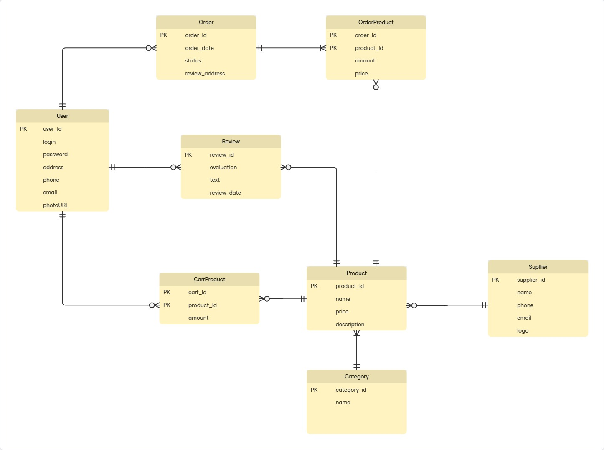

# Звіт до лабороторної 1
## Тема: Збір вимог та розробки схеми ER
## Короткий виклад вимог
Необхідно розробити базу даних для невеликого онлайн-магазину, на якому користувач мав б можливість замовляти різні товари
## Дані для зберігання
+ Інформація про користувачів (User): облікові та контактні дані.

+ Каталог товарів (Product): назва, опис, ціна, зв'язки з категорією та постачальником.

+ Структурні дані: інформація про категорії (Category) та постачальників (Supplier).

+ Дані взаємодії: вміст кошика (CartProduct), дані замовлень (Order, OrderProduct) та відгуки (Review).
## Бізнес-правила
+ Один користувач може мати лише один активний кошик.

+ Користувач може оформити багато замовлень та залишити багато відгуків.

+ Кожен товар належить до однієї категорії та постачається одним постачальником.

+ Ціна товару фіксується на момент оформлення замовлення і не змінюється, якщо ціна в каталозі оновилася.

+ Адреса доставки вказується для кожного конкретного замовлення.
## Діаграма-ER

## Список сутностей з атрибутами
User - Зберігає інформацію про зареєстрованих користувачів.
+ user_id (PK): Унікальний ідентифікатор користувача.
+ login, password: Дані для автентифікації.
+ adress, phone, email: Контактна інформація.
+ photo_url: Посилання на зображення профілю.

Product - Зберігає інформацію про товари в каталозі.
+ product_id (PK): Унікальний ідентифікатор товару.
+ name: Назва
+ description: Детальний опис
+ price: Поточна ціна товару.

Order - Зберігає загальну інформацію про замовлення.
+ order_id (PK): Унікальний ідентифікатор замовлення.
+ order_date: Дата та час створення замовлення.
+ status: Поточний статус (напр., "в обробці", "відправлено").
+ order_address: Адреса доставки для цього замовлення.

Review - Зберігає відгуки користувачів про товари.
+ review_id (PK): Унікальний ідентифікатор відгука.
+ evaluation: Числова оцінка (напр., від 1 до 5).
+ text: Текстовий коментар.
+ review_date: Дата публікації відгука.

Category - Довідник категорій товарів.
+ category_id (PK): Унікальний ідентифікатор категорії.
+ name: Назва категорії.

Supplier - Довідник постачальників товарів.
+ supplier_id (PK): Унікальний ідентифікатор постачальника.
+ name, phone, email: Назва та контактні дані.
+ logo_url: Посилання на логотип.

CartProduct(асоціативна сутність)
+ product_id (FK): Ідентифікатор товару.
+ user_id (FK): Ідентифікатор кошика.
+ amount: Кількість одиниць товару.

OrderProduct(асоціативна сутність)
+ product_id (FK): Ідентифікатор товару.
+ order_id (FK): Ідентифікатор замовлення.
+ amount: Кількість одиниць товару.
+ price: Ціна товару на момент покупки.

## Поясненння зв'зків
+ User - Order (один-до-багатьох): Один користувач може створити багато замовлень, але кожне замовлення пов'язане лише з одним користувачем, який його оформив.

+ User - Review (один-до-багатьох): Користувач може написати багато відгуків на різні товари, проте кожен конкретний відгук залишений одним унікальним користувачем.

+ Product - Review (один-до-багатьох): Один товар може мати багато відгуків від різних користувачів, але кожен відгук стосується лише одного товару.

+ Category - Product (один-до-багатьох): В одній категорії може бути багато товарів, але кожен товар належить тільки до однієї категорії.

+ Supplier - Product (один-до-багатьох): Один постачальник може постачати багато різних товарів, але кожен товар має лише одного постачальника.

+ User - Product (багато-до-багатьох через CartProduct): Один користувач може містити багато різних товарів, і один і той же товар може одночасно знаходитись у кошиках багатьох користувачів. Зв'язок реалізовано через проміжну таблицю CartProduct, яка зберігає кількість (amount) кожного товару в кожному кошику користувача.

+ Order - Product (багато-до-багатьох через OrderProduct): Одне замовлення може включати багато товарів, і один товар може бути частиною багатьох різних замовлень. Таблиця OrderProduct фіксує, які товари, в якій кількості та за якою ціною були включені до конкретного замовлення.
## Припущення та обмеження
+ Оцінка товару: Атрибут evaluation у таблиці Review є числовим значенням у фіксованому діапазоні (ціле число від 1 до 5).

+ Авторизація: Користувач повинен бути зареєстрований та авторизований для створення замовлення. 

+ Унікальність товару: Кожен товар (Product) може належати тільки до однієї категорії (Category) та мати тільки одного постачальника (Supplier). 

