# Звіт до лабороторної 3
## Тема: Маніпулювання даними SQL
### Select-запити
---
```sql
select * from order_product where order_id = 2
```
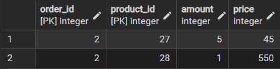
---
```sql
select name, price, description from product where product_id = 26 or product_id = 30
```
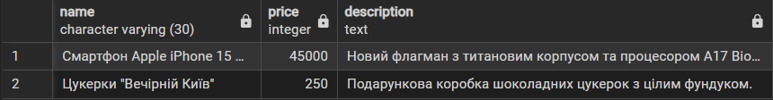
```sql
select login, address, phone from users where user_id = 19
```
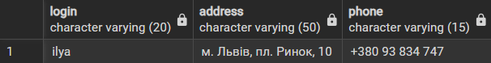
```sql
select order_date, user_id from orders where status = 'completed' or status = 'cancelled'
```
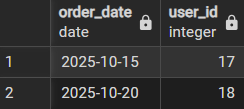
---
### Update-запити 
---
```sql
update users set email = 'sizonenko@gmail.com', phone = '+380 74 287 347' where user_id = 19
```
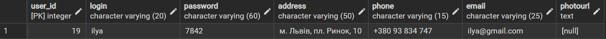
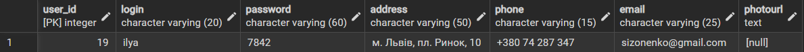
---
```sql
update product set price = 50000 where product_id = 26
```
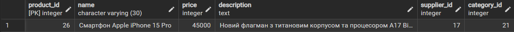
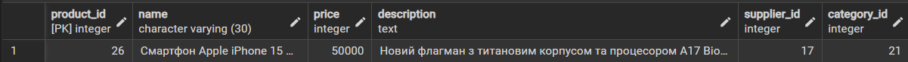
---
```sql
update orders set status = 'completed' where order_id = 2
```
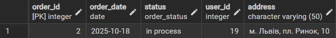
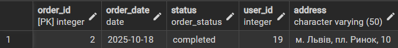
---
# Delete-запити 
---
```sql
delete from cart_product where user_id = 18
```
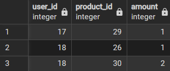
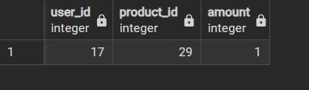


### Список таблиць з стовбцями
User - Зберігає інформацію про зареєстрованих користувачів
+ user_id (PK): Унікальний ідентифікатор користувача
+ login, password: Дані для автентифікації
+ adress, phone, email: Контактна інформаці
+ photoURL: Посилання на зображення профілю

Product - Зберігає інформацію про товари в каталозі.
+ product_id (PK): Унікальний ідентифікатор товару.
+ name: Назва
+ description: Детальний опис
+ price: Поточна ціна товару
+ supplier_id (FK): Зовнішній ключ, який посилається на таблицю supplier(supplier_id)
+ category_id (FK): Зовнішній ключ, який посилається на таблицю category(category_id)

Order - Зберігає загальну інформацію про замовлення
+ order_id (PK): Унікальний ідентифікатор замовлення
+ order_date: Дата та час створення замовлення
+ status: Поточний статус (напр., "в обробці", "відправлено")
+ address: Адреса доставки для цього замовлення
+ user_id (FK): Зовнішній ключ, який посилається на таблицю users

Review - Зберігає відгуки користувачів про товари
+ review_id (PK): Унікальний ідентифікатор відгука
+ evaluation: Числова оцінка (від 1 до 5)
+ text: Текстовий коментар
+ date: Дата публікації відгука
+ user_id (FK): Зовнішній ключ, який посилається на таблицю user(user_id)
+ product_id (FK): Зовнішній ключ, який посилається на таблицю product(product_id)

Category - Довідник категорій товарів.
+ category_id (PK): Унікальний ідентифікатор категорії.
+ name: Назва категорії.

Supplier - Довідник постачальників товарів.
+ supplier_id (PK): Унікальний ідентифікатор постачальника.
+ name, phone, email: Назва та контактні дані.
+ logo: Посилання на логотип.

CartProduct(асоціативна сутність)
+ product_id (FK): Ідентифікатор товару.
+ cart_id (FK): Ідентифікатор кошика.
+ amount: Кількість одиниць товару.

OrderProduct(асоціативна сутність)
+ product_id (FK): Ідентифікатор товару.
+ order_id (FK): Ідентифікатор замовлення.
+ amount: Кількість одиниць товару.
+ price: Ціна товару на момент покупки.

+ Order - Product (багато-до-багатьох через OrderProduct): Одне замовлення може включати багато товарів, і один товар може бути частиною багатьох різних замовлень. Таблиця OrderProduct фіксує, які товари, в якій кількості та за якою ціною були включені до конкретного замовлення.


