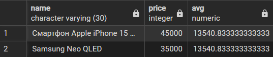
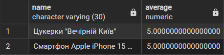
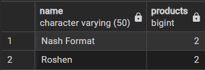
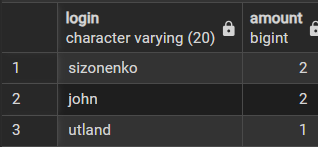
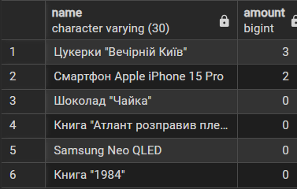
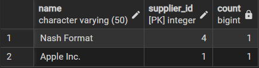

# Звіт до лабороторної 4
## Тема: Аналітичні SQL-запити
Товари, ціна яких вища за середню
```sql
with average_price as (
  select avg(price) as avg from product
)

select name, price, ap.avg
from product p
inner join average_price ap on ap.avg < p.price
```

---
Середня оцінка кожного товару, яка вища за середню оцінку усіх товарів
```sql
select p.name, avg(r.evaluation) as average
from product p
left join review r using (product_id)
group by p.product_id, p.name
having avg(r.evaluation) > (
   select avg(evaluation) from review
)
```

---
Вивести продавців, які пропонують більше, аніж 1 продукт
```sql
select s.name, count(product_id) as products
from supplier s
inner join product p using (supplier_id)
group by s.name, s.supplier_id
having count(product_id) > 1
```

---
Вивести 3 найбільш активних користувачів за кількістю замовлень
```sql
select u.login, count(o.order_id) as amount
from users u
inner join orders o using(user_id)
group by u.login
order by amount desc
limit 3
```

---
Вивести кількість одиниць товару, якого було продано
```sql
select p.name, 
    coalesce((
	   select sum(op.amount)
	   from order_product op
	   inner join orders o using(order_id)
	   where op.product_id = p.product_id and o.status = 'completed'
	), 0) as amount
from product p
order by amount desc
```

---
Кількість користувачів, яким Supplier хоч один раз продавав товари за останній місяць 
```sql
with orders_for_month as (
    select order_id, user_id from orders 
	where order_date >= current_date - interval '1 month'
)

select s.name, s.supplier_id, count(u.user_id)
from supplier s 
    inner join product p on s.supplier_id = p.supplier_id
    inner join order_product op on op.product_id = p.product_id
	inner join orders_for_month o on o.order_id = op.order_id
	inner join users u on u.user_id = o.user_id
group by s.name, s.supplier_id
```
