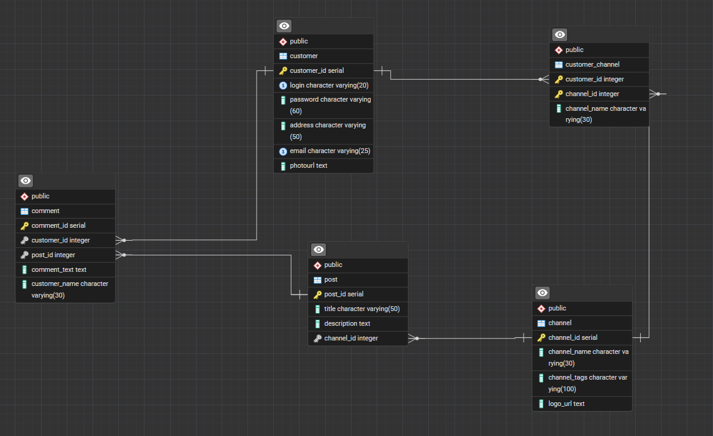
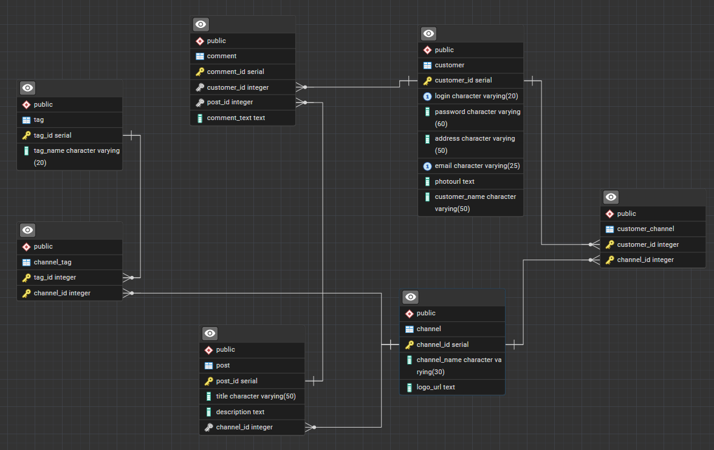

# Звіт до лабороторної 5
## Тема: Нормалізація бази даних 

## Аналіз бази даних
+ Усі атрибути усіх таблиць є атомарними, повторювані групи відсутні, що виконує критерій 1NF
+ В усіх асоціативних таблицях, де присутній складений ключ, жоден неключовий атрибут не залежить від частини цього ключа, що виконує критерій 2NF
+ В жодній таблиці немає транзитивної залежності, усі атрибути залежать лише від первинного ключа, тобто знаходяться в 3NF

Отже, в даному випадку усі таблиці виконують необхідний 3NF критерій, тому необхідность нормалізувати базу даних відсутня. З метою повноцінного виконання лабораторної роботи 5, пропоную розглянути приклад гіпотетичної бази даних, яка має погано структуровані таблиці.

### Приклад погано структурованого БД
```sql
create table if not exists channel (
	channel_id serial primary key,
	channel_name varchar(30) not null,
	channel_tags varchar(100) not null,
	logo_url text not null
);

create table if not exists post (
	post_id serial primary key,
	title varchar(50) not null,
	description text not null,
	channel_id integer not null references channel(channel_id)
)

create table if not exists comment (
	comment_id serial primary key,
	customer_id integer not null references customer(customer_id),
	post_id integer not null references post(post_id),
	comment_text text not null,
	customer_name varchar(30) not null
)

create table if not exists customer (
	customer_id serial primary key,
	login varchar(20) not null unique,
	password varchar(60) not null,
	address varchar(50),
	email varchar(25) not null unique,
	photoURL text
);

create table if not exists customer_channel (
    customer_id integer not null references customer(customer_id),
	channel_id integer not null references channel(channel_id),
	primary key(order_id, product_id),
	channel_name varchar(30) not null
);
```

## Table Channel
### Функціональня залежність
+ channel_id <- name, channel_tags, logo_url

### Перевірка критеріїв
+ 1NF - стовпець channel_tags може містити декілька значень, що порушує критерій 1NF
+ 2NF - PK простий, частокова залежність неможлива
+ 3NF - таблиця не має транзитивної залежності, усі неключові атрибути залежать тільки від первинного ключа

Виправлення: 
```sql
create table if not exists tag (
	tag_id serial primary key,
	tag_name varchar(20) not null
);

create table if not exists channel_tag (
	tag_id integer not null references tag(tag_id),
	channel_id integer not null references channel(channel_id),
	primary key(tag_id, channel_id)
);

alter table channel drop column channel_tags
```

## Table Comment
### Функціональня залежність
+ comment_id <- post_id, customer_id, text, customer_name
+ customer_id <- customer_name

### Перевірка критеріїв
+ 1NF - усі стовпці таблиці атомарні, повторення відсутні
+ 2NF - PK простий, частокова залежність неможлива
+ 3NF - має транзитивну залежність customer_login -> customer_id -> comment_id, що порушує критерій 3NF

Виправлення: 
```sql
alter table comment drop column customer_name;

alter table customer add column customer_name varchar(50) not null;
```

## Table CustomerChannel
### Функціональна залежність
+ channel_id <- channel_name

### Перевірка критеріїв
+ 1NF - усі стовпці таблиці атомарні, повторення відсутні
+ 2NF - має часткову залежність channel_name -> channel_id, що порушує 2NF
+ 3NF - таблиця не має транзитивної залежності, усі неключові атрибути залежать тільки від первинного ключа

Виправленна версія: 
```sql
alter table customer_channel drop column channel_name
```

### ERM-діаграма "до" та "після"


