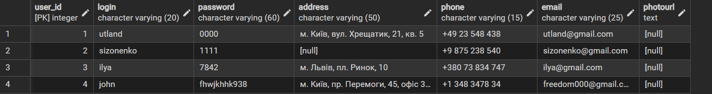
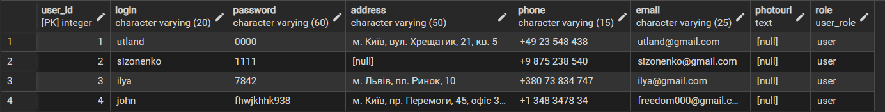
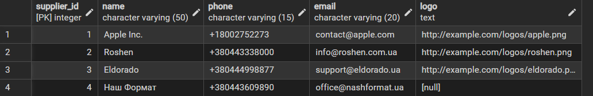
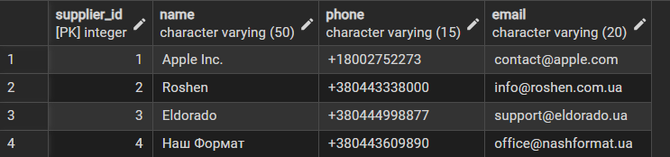
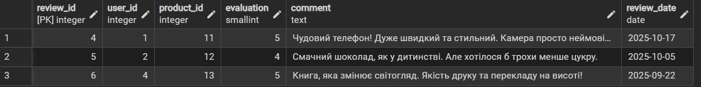
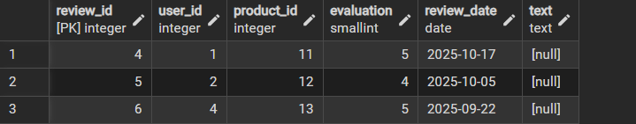
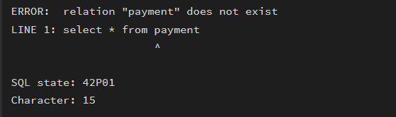
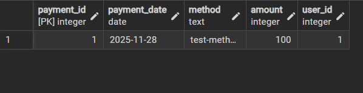

# Звіт до лабороторної 6
## Тема: Міграції схем за допомгоою PrismaORM

### Міграція 1(Додаємо колонку role)

До
>Модель з схеми:
```sql
model users {
  user_id      Int            @id @default(autoincrement())
  login        String         @unique @db.VarChar(20)
  password     String         @db.VarChar(60)
  address      String?        @db.VarChar(50)
  phone        String         @db.VarChar(15)
  email        String         @unique @db.VarChar(25)
  photourl     String?
  cart_product cart_product[]
  orders       orders[]
  review       review[]
}
```
>Вигляд у pgadmin
```sql
insert * from users
```


Після

>Модель з схеми:
```sql
model users {
  user_id      Int            @id @default(autoincrement())
  login        String         @unique @db.VarChar(20)
  password     String         @db.VarChar(60)
  address      String?        @db.VarChar(50)
  phone        String         @db.VarChar(15)
  email        String         @unique @db.VarChar(25)
  photourl     String?
  cart_product cart_product[]
  orders       orders[]
  review       review[]
  role         user_role      @default(user) //додали колонку
}

enum user_role {
  user
  admin
}
```
>Вигляд у pgadmin
```sql
insert * from users
```


### Міграція 2(Видалення колонки logo)

До

>Модель з схеми:
```sql
model supplier {
  supplier_id Int       @id @default(autoincrement())
  name        String    @db.VarChar(50)
  phone       String    @db.VarChar(15)
  email       String    @db.VarChar(20)
  logo        String? // -- колонка logo
  product     product[]
}
```
>Вигляд у pgadmin
```sql
insert * from supplier
```


Після

>Модель з схеми:
```sql
model supplier {
  supplier_id Int       @id @default(autoincrement())
  name        String    @db.VarChar(50)
  phone       String    @db.VarChar(15)
  email       String    @db.VarChar(20)
  product     product[]
}
```
>Вигляд у pgadmin
```sql
insert * from supplier
```


### Міграція 3(Переіменування колонки "comment")

До

>Модель з схеми:
```sql
model review {
  review_id   Int      @id @default(autoincrement())
  user_id     Int
  product_id  Int
  evaluation  Int      @db.SmallInt
  comment     String? 
  review_date DateTime @db.Date
  product     product  @relation(fields: [product_id], references: [product_id], onDelete: NoAction, onUpdate: NoAction)
  users       users    @relation(fields: [user_id], references: [user_id], onDelete: NoAction, onUpdate: NoAction)
}
```
>Вигляд у pgadmin
```sql
insert * from review
```


Після

>Модель з схеми:
```sql
model review {
  review_id   Int      @id @default(autoincrement())
  user_id     Int
  product_id  Int
  evaluation  Int      @db.SmallInt
  text     String? // -- переіменовуємо колонку comment
  review_date DateTime @db.Date
  product     product  @relation(fields: [product_id], references: [product_id], onDelete: NoAction, onUpdate: NoAction)
  users       users    @relation(fields: [user_id], references: [user_id], onDelete: NoAction, onUpdate: NoAction)
}
```
>Вигляд у pgadmin
```sql
insert * from review
```


### Міграція 4(Створення нової таблиці Payment)

До

>Вигляд у pgadmin
```sql
insert * from payment
```


Після

>Модель з схеми:
```sql
// Створюємо нову таблицю та оновлюємо зв`язки в інших
model payment {
  payment_id   Int           @id @default(autoincrement())
  payment_date DateTime      @db.Date()
  method       String        @db.Text()
  amount       Int           @db.Integer()
  user_id      Int
  orders       orders[] 
  user         users         @relation(fields: [user_id], references: [user_id])               
}

model users {
  user_id      Int            @id @default(autoincrement())
  login        String         @unique @db.VarChar(20)
  password     String         @db.VarChar(60)
  address      String?        @db.VarChar(50)
  phone        String         @db.VarChar(15)
  email        String         @unique @db.VarChar(25)
  photourl     String?
  cart_product cart_product[]
  orders       orders[]
  review       review[]
  payments     payment[]
  role         user_role      @default(user)
}

model orders {
  order_id      Int             @id @default(autoincrement())
  order_date    DateTime        @db.Date
  status        order_status
  user_id       Int
  payment_id    Int
  address       String          @db.VarChar(50)
  order_product order_product[]
  users         users           @relation(fields: [user_id], references: [user_id], onDelete: NoAction, onUpdate: NoAction)
  payment       payment         @relation(fields: [payment_id], references: [payment_id])
}
```
>Вигляд у pgadmin
```sql
insert * from payment
```
